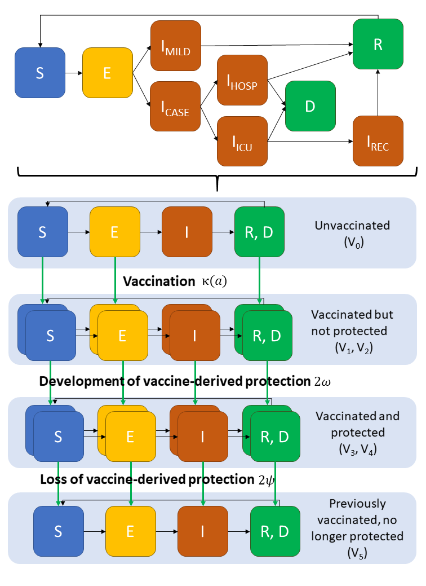

<!-- README.md is generated from README.Rmd. Please edit that file -->

```{r, include = FALSE}
knitr::opts_chunk$set(
  collapse = TRUE,
  comment = "#>",
  fig.path = "man/figures/README-",
  out.width = "100%"
)

library(nimue)
library(dplyr)
library(ggplot2)
```

# nimue

<!-- badges: start -->
[](https://www.repostatus.org/#wip)
[](https://github.com/mrc-ide/nimue/actions)
[](https://codecov.io/gh/mrc-ide/nimue)
<!-- badges: end -->

## IMPORTANT NOTES

:warning: This code is released with no support. Please submit any questions or bugs as [issues](https://github.com/mrc-ide/nimue/issues) and we will try to address them as quickly as possible.

:warning: This model is in active development and so parameter name and behaviours, and output file formats will change without notice.

:warning: The model is stochastic. Multiple runs with different seeds should be undertaken to see average behaviour.

:warning: As with any mathematical model, it is easy to misconfigure inputs and therefore get meaningless outputs. Please contact the authors if you intend to publish results using `nimue`.

Nimue is built on the shoulders of [squire](https://mrc-ide.github.io/squire/) and [sircovid](https://mrc-ide.github.io/sircovid/).
Nimue is named after the [Lady of the Lake](https://en.wikipedia.org/wiki/Lady_of_the_Lake)

## Installation

You can install the development version from [GitHub](https://github.com/) with:

``` r
# install.packages("devtools")
devtools::install_github("mrc-ide/nimue")
```

## Overview

Nimue is an extension to the [squire package](https://mrc-ide.github.io/squire/) that allows vaccination to be included.
For detailed information on the base model structure and parameterisation please visit the [squire webpage](https://mrc-ide.github.io/squire/).

Nimue adds an additional dimension to the squire model, allowing us to track the vaccination status across the modelled population. This allows us to categorise
people into 4 groups:

1. Unvaccinated - those who have not yet received a vaccine course.
2. Vaccinated but not protected - those who have received a vaccine course, but are not yet protected by the vaccine.
3. Vaccinated and protected - those who have received a vaccine course and are protected.
4. Previously vaccinated - those who were previously protected by the vaccine but are no longer so.

#### Schematic of the vaccination model structure


Nimue includes the flexibility to model different generic vaccine profiles, distribution and prioritisation approaches:

1. Vaccine mode of action: infection blocking and/or disease blocking.
2. Vaccine efficacy.
3. Age varying-efficacy.
4. Duration of vaccine-acquired immunity.
5. Age-dependent targeting and prioritisation strategies.

## Simple run

Running Nimue is very similar to squire, in the most simple case we can specify a country and run a scenario:

```{r}
run1 <- run(country = "France")
```

To help us visualise the run we can format the raw nimue model output, in this case selecting just the output for infections:

```{r, warning=FALSE}
# Format output, selecting a subset and naming the run.
output1 <- format(run1, summaries = "infections", compartments = NULL) %>%
  mutate(Run = "Simple run")
# Plot
ggplot(output1, aes(x = t, y = value))  +
  geom_line(col = "darkblue", size = 1) +
  ylab("Infections") + 
  xlab("Time") + 
  theme_bw()
```

We can add in a very simple vaccination scenario, with a highly efficacious (95%), infection blocking vaccine that is distributed very quickly (500,000 individuals per day), and compare the results:

```{r, warning=FALSE}
run2 <- run(country = "France", max_vaccine = 500000, vaccine_efficacy_infection = rep(0.95, 17))
output2 <- format(run2, summaries = "infections", compartments = NULL) %>%
  mutate(Run = "Efficacious vaccine")

ggplot(bind_rows(output1, output2), aes(x = t, y = value, col = Run))  +
  geom_line(size = 1) +
  ylab("Infections") + 
  xlab("Time") + 
  theme_bw()
```

To see demonstrations of full vaccine functionality please see the articles on:

1. Efficacy
2. Supply
3. Coverage and Prioritisation

